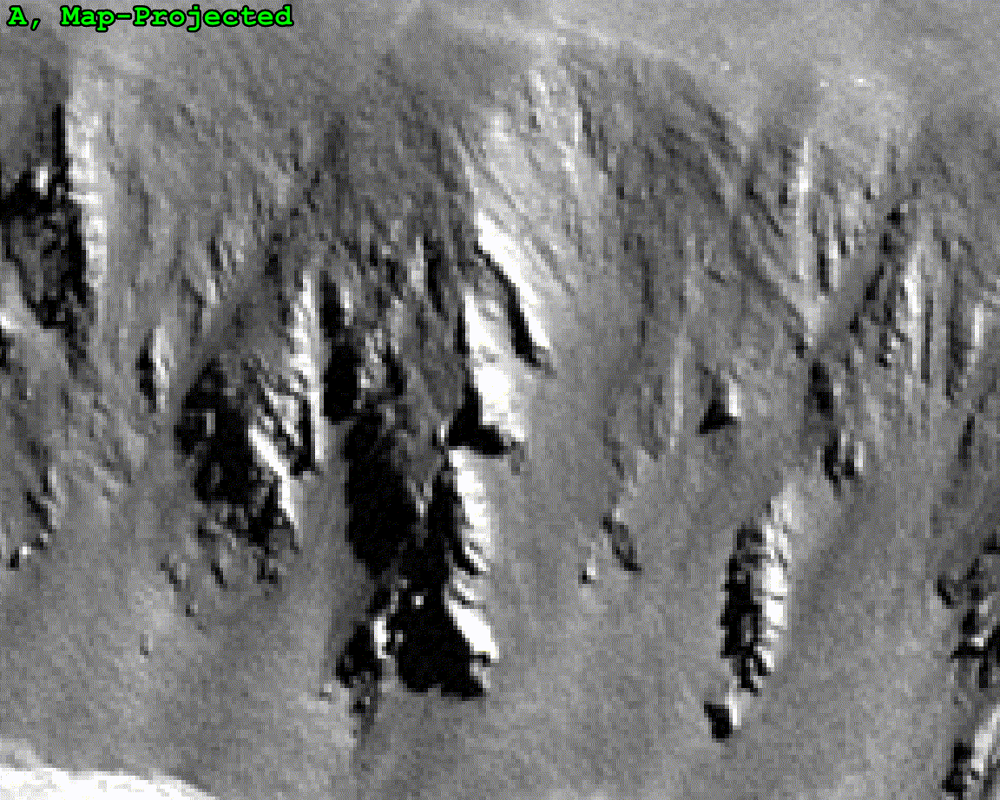

# Processing SPOT6/7 Images with the Ames Stereo Pipeline

This repository is associated with:

  _Purinton, B.; Mueting, A.; Bookhagen, B. [TITLE]. Remote Sensing. 2022. In preparation._

Prior to running the Ames Stereo Pipeline on the SPOT6 images, we convert them from their native, tiled format with external Rational Polynomial Coefficient (RPC) files, to a GeoTiff format with the RPC data contained in the file header using the following GDAL command. Since Ames also needs the original *.xml RPC file for processing purposes to be fed into the pipeline at various steps, we also rename this file to match our GeoTiff filename. These commands are run in each of the three directories containing the A, B, and C tristereo images:

```
cd /path/to/SPOT6-A-image/tiles/
gdal_translate DIM_SPOT6_*.XML A.tif -co TILED=YES
cp RPC_SPOT*_*.XML A.XML

cd /path/to/SPOT6-B-image/tiles/
gdal_translate DIM_SPOT6_*.XML B.tif -co TILED=YES
cp RPC_SPOT*_*.XML B.XML

cd /path/to/SPOT6-C-image/tiles/
gdal_translate DIM_SPOT6_*.XML C.tif -co TILED=YES
cp RPC_SPOT*_*.XML C.XML
```

We note that the `ames_spot_processing.sh` file contains these preprocessing commands.

# SPOT6 A scene prior to and following map-projection


# Difference (disparity) between SPOT6 A and C scenes following individual map-projection

